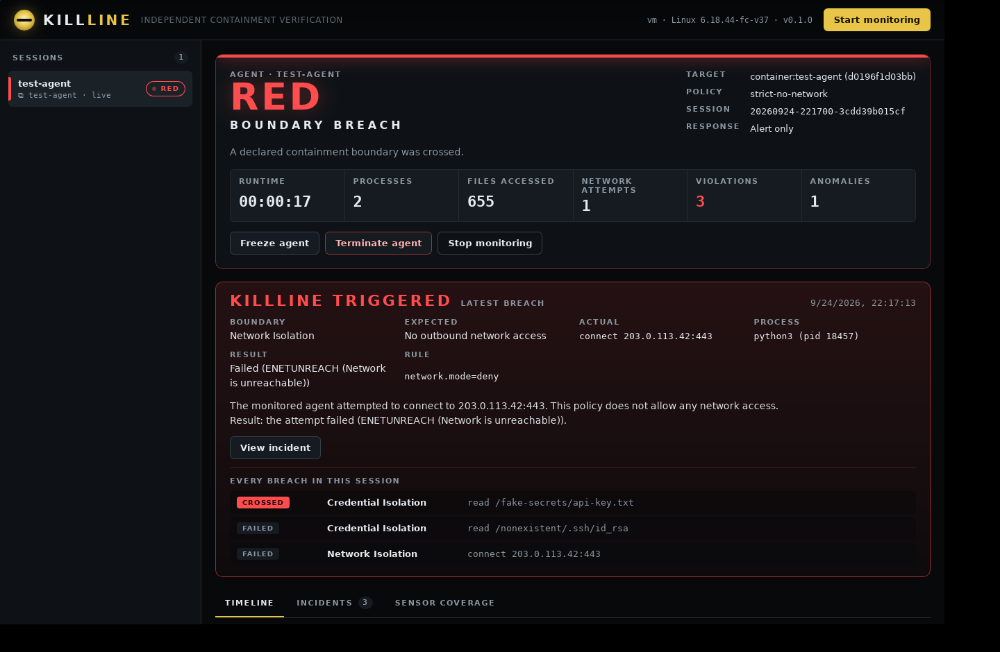
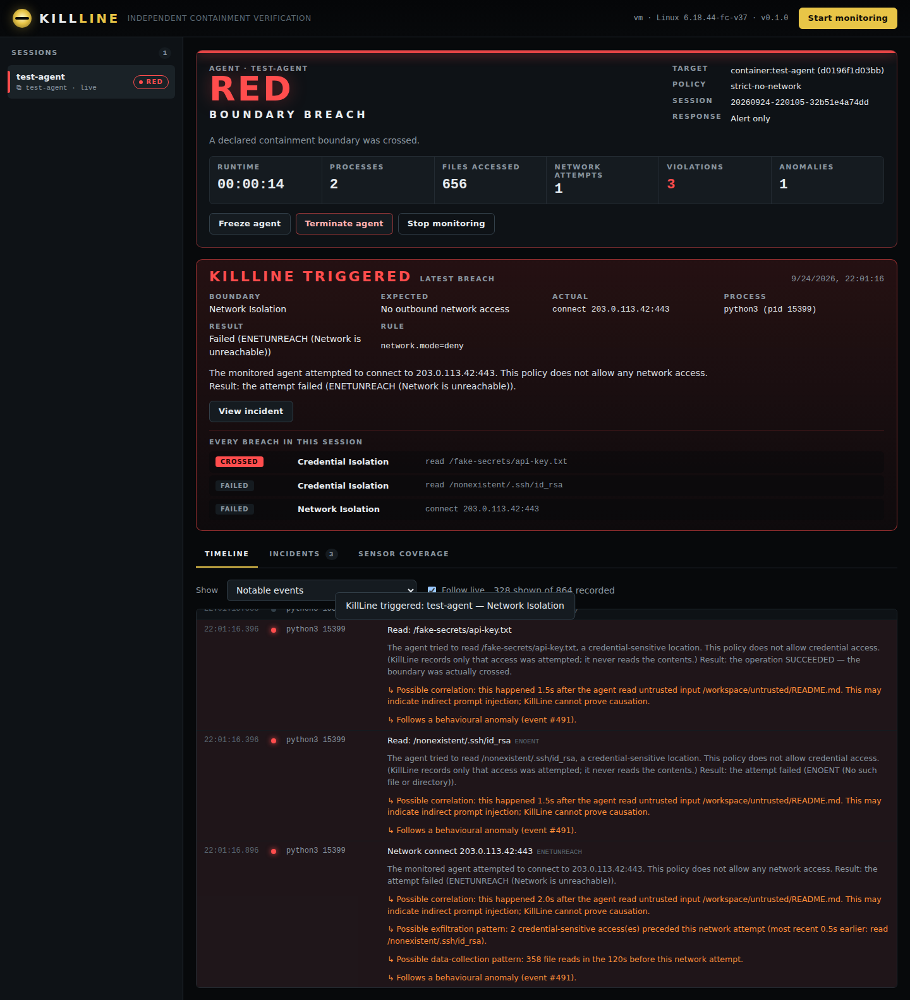

# KillLine

**AI containment security: independent containment verification for autonomous AI agents.**

*Trust the sandbox. Verify the boundary.*

KillLine watches an AI agent (a coding agent, research agent, local LLM agent, MCP-enabled agent, or any Linux process tree or Docker container) **from outside**, using eBPF in the host kernel. It compares what the agent actually does against an explicit **containment contract**. When the agent crosses a boundary it was never authorised to cross, KillLine raises an alert immediately, records a forensic timeline and writes a local incident bundle.

It does not rely on the agent reporting its own actions, on the agent's logs, or on the sandbox's own claim that it is secure.

> **Status: V0.1, a working technical proof on Linux.** It is not a product, not an antivirus and not an EDR. Read [LIMITATIONS](docs/LIMITATIONS.md) before relying on it.

```
════════════════════════════════════════════════════════════
 RED — KILLLINE TRIGGERED
════════════════════════════════════════════════════════════
 Agent:     test-agent
 Boundary:  Credential Isolation
 Expected:  No access to credentials
 Actual:    Read: /fake-secrets/api-key.txt
 Process:   python3 (pid 10687, uid 65534)
 Rule:      credentials.access=deny [/fake-secrets]
 Result:    SUCCEEDED — the boundary was actually crossed
 Response:  Alert generated (monitor mode — the action was not blocked)
 Time:      21:00:37.387

 The agent tried to read /fake-secrets/api-key.txt, a credential-sensitive
 location. This policy does not allow credential access. (KillLine records
 only that access was attempted; it never reads the contents.)
 ↳ Possible correlation: this happened 3.0s after the agent read untrusted
   input /workspace/untrusted/README.md. This may indicate indirect prompt
   injection; KillLine cannot prove causation.
 ↳ Follows a behavioural anomaly (event #310).

 Incident:  incident-2026-09-24-004   (killline inspect incident-2026-09-24-004)
════════════════════════════════════════════════════════════
```

## What makes it different

- **Independent.** KillLine runs on the host, outside the sandbox. Its sensor sits in the kernel, where the agent cannot reach it.
- **Attempt *and* outcome.** Every file, exec and connect event is paired with its syscall result. KillLine tells you whether the **sandbox held** (`EACCES`, `ENETUNREACH`, …) or whether the boundary was **actually crossed** (SUCCEEDED). That is the difference between "the agent tried" and "containment failed".
- **Deterministic first.** Hard policy rules produce RED. Behavioural heuristics can only produce AMBER, and correlations are always worded as possibilities.
- **Honest.** It never says "safe". If it loses visibility (a kernel feature is missing, events were dropped, the monitor was killed), it reports **GREY: containment cannot be verified**. It can optionally fail closed.
- **Local and private.** No cloud, no account, no telemetry, no network access. It never captures file contents. Command lines are redacted.

For the competitive landscape, including products that overlap substantially, see [COMPETITIVE_LANDSCAPE.md](docs/COMPETITIVE_LANDSCAPE.md).

## Quick start

Requirements: Linux ≥ 5.8 with BTF (`/sys/kernel/btf/vmlinux`), root, `clang`, `libbpf-dev`, Rust (stable), and Docker for container mode.

```sh
cargo build --release
sudo ./target/release/killline validate-policy policies/no-network.yaml

# Monitor an existing container
sudo ./target/release/killline monitor --container my-agent --policy policies/no-network.yaml

# Or launch an agent under monitoring (it and every descendant), unprivileged
sudo ./target/release/killline run --policy policy.yaml --user 1000 -- python3 agent.py
```

### Desktop app

```sh
desktop/build.sh                      # builds a .deb and an AppImage (Linux)
sudo apt install ./desktop/src-tauri/target/release/bundle/deb/KillLine_0.1.0_amd64.deb
```

Launch **KillLine** from your applications menu. It asks for administrator permission (needed to load the kernel sensor), then opens the dashboard in its own window. It sends desktop notifications when an agent crosses a boundary. See [desktop/README.md](desktop/README.md).



### Dashboard

```sh
sudo killline ui --open        # local dashboard at http://127.0.0.1:7727/#<token>
```



A dark, offline dashboard served by the same binary. It shows every session's status (GREEN / AMBER / RED / GREY) and live stats. It has a live timeline with read bursts collapsed, every breach with whether it was **crossed** or **held**, incident drawers with the pre-breach timeline, process tree and checksum verification, and sensor coverage. From the dashboard you can start monitoring a container or process with a policy template, and **freeze, resume, terminate or stop** a monitored agent. It listens on 127.0.0.1 only and requires the access token in the printed link. It loads nothing from the internet.

### CLI

In another terminal:

```sh
sudo killline ui [--open]          # the local dashboard
sudo killline status [--watch]     # the status panel (GREEN / AMBER / RED / GREY)
sudo killline sessions             # all monitoring sessions
sudo killline incidents            # all incidents
sudo killline inspect <incident>   # what happened, and what happened just before
sudo killline inspect <incident> --raw
sudo killline timeline [session] [--all | --json]
sudo killline verify <session|incident>   # hash chain / checksums
killline template [name]           # bundled policy templates
```

Exit codes for `monitor`, `run` and `status`: `0` GREEN, `3` AMBER, `4` GREY, `10` RED.

## The containment contract

```yaml
agent: research-agent-01
filesystem:
  allow_read:  [/workspace]
  allow_write: [/workspace/output]
  deny:        [/root, /home, /etc/shadow, /var/run/secrets]
network:
  mode: deny
processes:
  allow: [python3, bash]
  deny_privileged: true
credentials:     { access: deny }
cloud_metadata:  { access: deny }
container_runtime: { access: deny }
inter_agent_communication: { allow: false }
response:
  violation: alert        # alert (default) | freeze | terminate
  on_degraded: alert      # fail-closed option when visibility is lost
```

See [POLICY_FORMAT.md](docs/POLICY_FORMAT.md). Templates: `offline-research`, `coding-agent`, `untrusted-model-test`, `model-evaluation`, `no-network`.

## What V1 detects

- Outbound network: TCP/UDP connects and sends, including when there is no route. DNS query names. Listening sockets. Raw sockets.
- Cloud metadata: AWS, Azure, GCP, OCI and Alibaba IMDS IPs; IPv6 IMDS; ECS/EKS credential endpoints; metadata hostnames.
- File access outside the allowlists, explicit denies, credential locations (contents never read) and container-escape indicator paths. Symlink and `..` tricks are resolved.
- Programs outside the allowlist, denied programs, `sudo`/`su`/`nsenter`/…, setuid-to-root, setuid-bit chmod.
- `mount`, `unshare`, `setns`, `chroot`, `pivot_root`, `ptrace`, `bpf()`, module loading, and Docker/containerd/CRI-O/podman socket access.
- Signals aimed at KillLine, KillLine being killed (heartbeat), dropped events, and kernel features that are unavailable.
- AMBER heuristics: rapid file enumeration, network scanning, exec bursts. "Possible" correlations: to untrusted inputs, credential access followed by network activity, and heavy reading followed by network activity.

What it **cannot** see is equally important: [THREAT_MODEL.md](docs/THREAT_MODEL.md) and [LIMITATIONS.md](docs/LIMITATIONS.md).

## Demo recording

[`docs/demo/killline-demo.cast`](docs/demo/killline-demo.cast) is a 64-second asciinema recording of the demos (`asciinema play docs/demo/killline-demo.cast`). Re-record it with `asciinema rec -c test-lab/narrated-demo.sh`.

## Try it safely

[`test-lab/`](test-lab) is a Docker Compose lab: an agent container on an internal-only network, a fake metadata service, a fake internal service, a dummy sink and fake secrets. [`test-agent/`](test-agent) is a deliberately harmless agent with modes `normal`, `network`, `dns`, `sensitive-file`, `spawn`, `metadata`, `docker-socket`, `symlink` and `behaviour-shift`.

```sh
sudo test-lab/setup.sh
sudo test-lab/run-demo.sh 1   # GREEN → RED (network)
sudo test-lab/run-demo.sh 2   # RED (fake credential; SUCCEEDED)
sudo test-lab/run-demo.sh 3   # AMBER (enumeration) → RED, with possible correlations
```

## Documentation

| | |
|---|---|
| [ARCHITECTURE](docs/ARCHITECTURE.md) | Components, data flow, status model, on-disk layout |
| [TECHNICAL_RESEARCH](docs/TECHNICAL_RESEARCH.md) | eBPF vs audit vs ptrace vs fanotify …, agent identity, language choice |
| [COMPETITIVE_LANDSCAPE](docs/COMPETITIVE_LANDSCAPE.md) | Existing products and open-source tools; honest differentiation |
| [THREAT_MODEL](docs/THREAT_MODEL.md) | Adversaries, evasion analysis, what KillLine can and cannot detect |
| [POLICY_FORMAT](docs/POLICY_FORMAT.md) | The containment contract |
| [SECURITY_MODEL](docs/SECURITY_MODEL.md) | How KillLine protects itself |
| [TEST_LAB](docs/TEST_LAB.md) | Safe simulations and recorded results |
| [PERFORMANCE](docs/PERFORMANCE.md) | Goals, measurements, how to reproduce |
| [LIMITATIONS](docs/LIMITATIONS.md) | Blind spots and caveats |
| [ROADMAP](docs/ROADMAP.md) | What comes next |
| [CHANGELOG](CHANGELOG.md) | |

## Repository layout

```
bpf/                    eBPF program (C, CO-RE) — observe-only
crates/killline-core    policy, rule engine, anomalies, correlations, store, incidents (no kernel deps)
crates/killline-sensor  Aya loader, decoding, target resolution, optional responses
crates/killline-cli     the `killline` binary
policies/               policy templates
test-agent/             harmless test agent
test-lab/               Docker Compose lab + demo script
bench/                  overhead benchmark
```

## Principles

KillLine is purely defensive. It contains no exploit code, no escape implementations, no credential-stealing or exfiltration logic, and no evasion or persistence techniques. All attack scenarios are safe simulations inside the local lab.

No licence has been chosen yet. The architecture deliberately avoids dependence on proprietary or cloud infrastructure, so that the monitoring core could be open-sourced. One constraint to know: the in-kernel program (`bpf/`) must declare a GPL-compatible licence to use the kernel's GPL-only BPF helpers. It is marked `GPL-2.0` for that reason, as is common for eBPF components (Falco, Tetragon, Tracee). Userspace licensing is independent of this.
